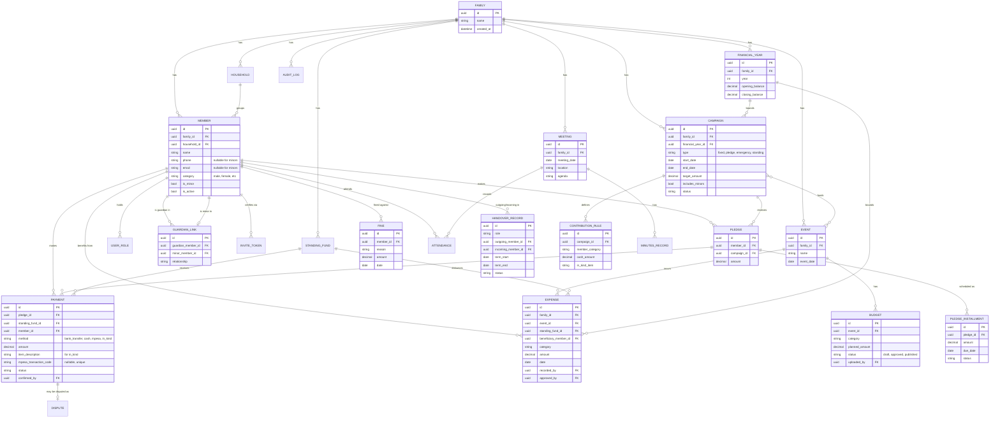

# Data Model

## Entity-Relationship Diagram

## Notes on Key Design Choices

### Campaign ↔ Event: many-to-many
A **Campaign** raises money; an **Event** is what the money is for. The family's own example — monthly AGM contributions funding the End-Year Party — already shows they aren't one-to-one: one event can be funded by several campaigns, and (less commonly) a single broad campaign could contribute toward more than one event. This is modeled as a join relationship (`CAMPAIGN }o--o{ EVENT`) rather than a foreign key on either side.

### Minors are `Member` rows, not a separate table
A minor is a `Member` with `is_minor = true` and `phone`/`email` left null. This keeps every relationship that already points at `Member` — `Pledge`, `Payment`, `Attendance`, `Fine` — working unchanged for minors, rather than needing parallel tables and parallel foreign keys everywhere. `GUARDIAN_LINK` is the only place the guardian/minor relationship is explicit.

### `ContributionRule` instead of hardcoded amounts
The family's AGM structure (different cash/in-kind amounts by category) is stored as **data attached to a campaign**, not application logic. Changing an amount, or adding a new category, is a data change — not a code deployment.

### `PledgeInstallment` as its own entity
Recurring monthly AGM collection toward one annual deadline needs more than a single amount+date on `Pledge` — each installment has its own due date and fulfillment status, so it's modeled as a child table.

### `StandingFund` is structurally different from `Campaign`
A welfare/emergency fund has no `end_date` and no target — it's an always-open running balance. Rather than forcing it into `Campaign`'s time-boxed shape, it gets its own light entity that `Payment` and `Expense` can both reference.

### `Payment.method` includes `in_kind`
A hen is not cash. Payments carry a `method` and, for `in_kind`, an `item_description` and estimated value — this keeps a single payment table instead of splitting cash and in-kind contributions into separate flows.

### `FinancialYear` as the reporting boundary
Annual reports, opening/closing balances, and year-over-year comparisons all need a clean period boundary. `Campaign` and `Expense` both reference the `FinancialYear` they belong to, so an annual report is a filtered aggregation query, not a bespoke calculation.

### `Document` (not shown above, generic attachment)
A reusable polymorphic attachment table (`entity_type`, `entity_id`, `file_url`, `uploaded_by`) backs published budgets, expense receipts, dispute evidence, and minutes attachments — one mechanism instead of four.
