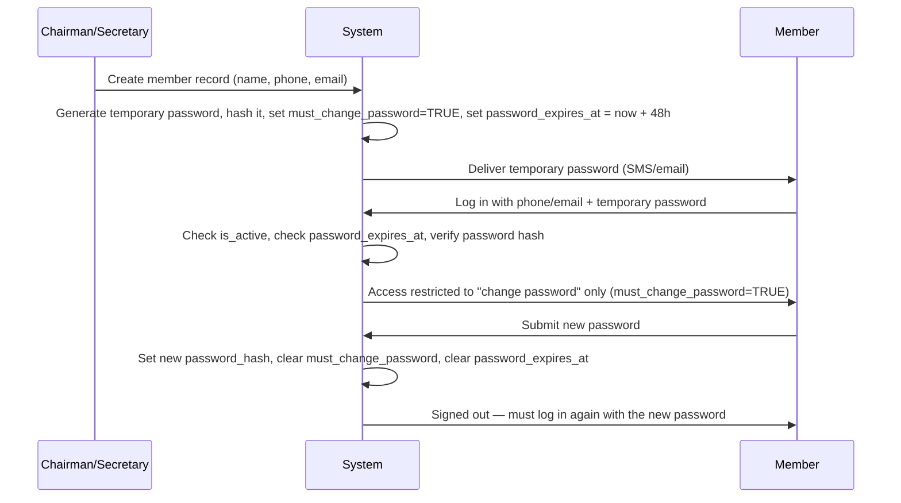

# Security & Privacy

This page explains **how**, not just **what** — the reasoning behind each safety-sensitive flow in the system.

## Onboarding: preventing impersonation

## Onboarding: Chairman-issued temporary passwords

There's no invite link or OTP step — the Chairman creates the member record directly, and the system issues credentials immediately.

!!! warning "Why this matters"
    A temporary password has a real expiry — if the member doesn't log in and change it within the window, the system rejects the login outright and tells them to request a new one from the Chairman, rather than silently letting a stale credential work indefinitely. Once a member sets their own permanent password, no forced expiry applies unless a periodic-rotation policy is added later as a separate decision.

## Active status: a universal gate, not a per-feature check

`is_active` is checked in exactly one place — the point where a session token is resolved back into a member record — rather than being re-checked separately inside every router. This matters because it means a deactivated member is blocked from **everything** the moment Chairman flips the switch, with no risk of a forgotten endpoint that never learned to check it. Role checks (`require_role`) still run per-action on top of this — active status answers "can this person use the system at all," roles answer "what specifically can they do."

## Bulk onboarding: same guarantees, less manual entry

Chairman can onboard members one at a time or as a batch (e.g. a list of names/phones submitted together). Every member in a batch still goes through the identical process as a solo onboard — their own independently generated temporary password, their own expiry, their own `must_change_password` flag. Nothing is shared or reused across a batch. If one row in a batch conflicts with an existing record (e.g. a duplicate phone number), that row is reported as failed while the rest of the batch still succeeds — a single bad row shouldn't block onboarding 59 other people.

## Temporary password delivery: stubbed, not skipped

Delivering a temporary password requires an SMS/email channel, which properly belongs to `feature/notifications` — a branch that doesn't exist yet. Rather than blocking `feature/auth` on that dependency, `send_sms()` is stubbed to log the message to the console. Every other part of the onboarding flow — password generation, hashing, expiry, forced change — is fully real and testable today; only the actual delivery mechanism is a placeholder, and swapping in a real SMS gateway later requires no change to any code that calls `send_sms()`.

## Minors: no account, no exposure

Minors never receive login credentials — not now, not in a future version. This isn't a missing feature; it's a deliberate boundary:

- `phone` and `email` are simply left null on their `Member` record.
- Every action taken "for" a minor (pledge, payment) is actually performed by an authenticated adult — a Guardian, or Treasurer/Chairman for in-person cash — and attributed to that adult in the audit trail, with the minor recorded as the beneficiary.
- There is no code path anywhere that issues a session, JWT, or OTP to a `Member` flagged `is_minor = true`.

## Privacy: aggregate-only, enforced at the query layer

The rule "no member sees another member's individual contribution" is enforced **server-side**, not by hiding fields in the UI:

- Public/member-facing endpoints return only aggregate figures (`total_contributed`, `remaining`, contributor **count**).
- Any endpoint that would expose a per-member amount checks the requester's role first — only Treasurer, Chairman, or the member viewing **their own** record can receive individual figures.
- This is a single, reusable authorization rule applied consistently, so a new report or dashboard added later inherits the same protection instead of needing it re-implemented.

## Guardian actions: independence with accountability

Guardians act **without** requiring Chairman/Treasurer co-approval — but "no approval needed" is not the same as "no record kept." Every Guardian-initiated pledge or payment is:

- Attributed to the Guardian's account in the `AuditLog`.
- Linked to the minor beneficiary via `GuardianLink`.
- Visible to the Guardian and to Treasurer/Chairman — but not to other members, under the same privacy rule as any other payment.

## Payments: idempotency and financial integrity

- **M-Pesa callbacks** (once enabled) are deduplicated on a **unique `mpesa_transaction_code` constraint** — a retried or duplicate callback from Safaricom cannot create a second payment record.
- **All write endpoints**, not just M-Pesa, accept an idempotency key — protecting against double-submits, which are common when an elderly or non-technical user taps "Pay" twice, unsure if the first tap registered.
- **Payment confirmation and pledge-fulfillment updates happen inside one database transaction.** A payment is never marked confirmed while the linked pledge's fulfilled amount fails to update — the two changes succeed or fail together.
- **Money fields are fixed-point/decimal, never floating point.** Floating-point rounding errors are unacceptable in financial records, however small the amounts involved.

## Audit trail: the record that can't be edited away

Every financial and administrative action — pledges, payments, expenses, fines, approvals, role changes, minute locks — writes an immutable `AuditLog` entry: actor, action, entity, before/after state, timestamp. Financial records are **never hard-deleted**; corrections are soft-deletes/voids with a reason, so the history of what happened is always reconstructable, including mistakes and their corrections.

## Role-based access control (RBAC)

Every admin endpoint checks the requester's role(s) before executing. Because roles are many-to-many, a single user can carry multiple permission sets (e.g. Chairman *and* Guardian) — the authorization check evaluates the union of a user's roles, not a single assumed role.

## Backups & recovery

- Automated backups run at least daily, stored separately from the primary database (not on the same disk/instance).
- A documented restore procedure exists and is **tested periodically** — an untested backup is not a real backup.
- This matters more, not less, at a small scale: there's no dedicated operations team to catch a failure quickly, so recovery has to work correctly the first time it's actually needed.

## Leadership handover: preventing a permissions gap or overlap

A `HandoverRecord` requires **explicit confirmation from the outgoing officer** before the incoming officer's permissions activate — this prevents a moment where either both people have full admin rights simultaneously, or neither does. The 3-year term structure means this flow will run repeatedly over the system's life, so it's built as a proper state machine (`pending → confirmed → active`) rather than a one-off admin action.
